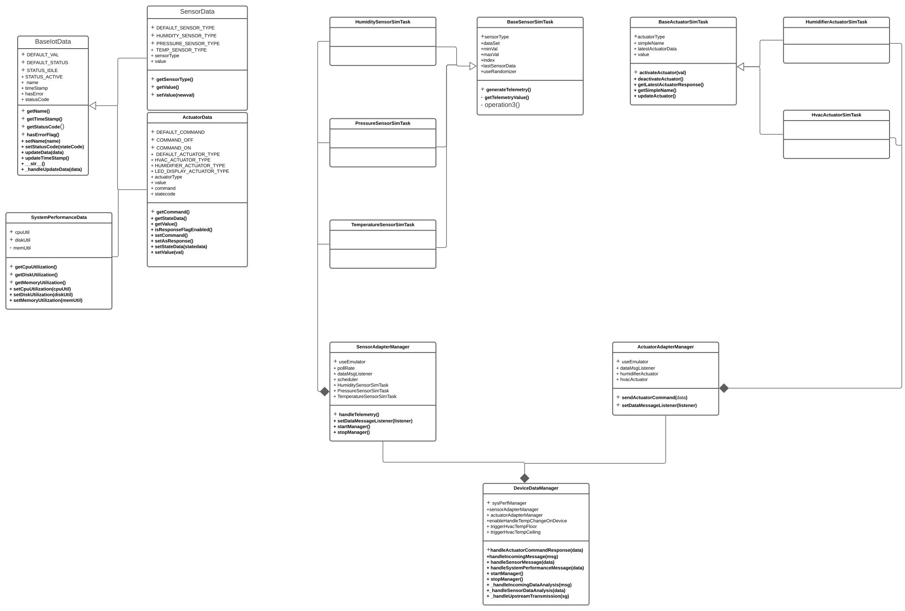

# Constrained Device Application (Connected Devices)

## Lab Module 03

Be sure to implement all the PIOT-CDA-* issues (requirements) listed at [PIOT-INF-03-001 - Chapter 03](https://github.com/orgs/programming-the-iot/projects/1#column-10488379).

### Description

NOTE: Include two full paragraphs describing your implementation approach by answering the questions listed below.

What does your implementation do? 

Implemented Data modules by using ActuatorData, SensorData and SystemPerformanceData which are both extends from BaseIotData. Implemented different simTasks modules which extends from BaseIotData. Create ActuatorAdapterManager and SensorAdapterManager and implement them in DeviceDataManager.

How does your implementation work?

All test passed as same as example.

### Code Repository and Branch

NOTE: Be sure to include the branch (e.g. https://github.com/programming-the-iot/python-components/tree/alpha001).

URL: //github.com/NU-CSYE6530-Fall2020/constrained-device-app-xuanwu-neu/tree/chapter03

### UML Design Diagram(s)

NOTE: Include one or more UML designs representing your solution. It's expected each
diagram you provide will look similar to, but not the same as, its counterpart in the
book [Programming the IoT](https://learning.oreilly.com/library/view/programming-the-internet/9781492081401/).

### Unit Tests Executed

NOTE: TA's will execute your unit tests. You only need to list each test case below
(e.g. ConfigUtilTest, DataUtilTest, etc). Be sure to include all previous tests, too,
since you need to ensure you haven't introduced regressions.

- src/test/python/programmingtheiot/part02/unit/data/ActuatorDataTest.py
- src/test/python/programmingtheiot/part02/unit/data/SensorDataTest.py
- src/test/python/programmingtheiot/part02/unit/data/SystemPerformanceDataTest.py
- src/test/python/programmingtheiot/part02/unit/sim/HumidifierActuatorSimTaskTest.py
- src/test/python/programmingtheiot/part02/unit/sim/HumiditySensorSimTaskTest.py
- src/test/python/programmingtheiot/part02/unit/sim/HvacActuatorSimTaskTest.py
- src/test/python/programmingtheiot/part02/unit/sim/PressureSensorSimTaskTest.py
- src/test/python/programmingtheiot/part02/unit/sim/TemperatureSensorSimTaskTest.py
### Integration Tests Executed

NOTE: TA's will execute most of your integration tests using their own environment, with
some exceptions (such as your cloud connectivity tests). In such cases, they'll review
your code to ensure it's correct. As for the tests you execute, you only need to list each
test case below (e.g. SensorSimAdapterManagerTest, DeviceDataManagerTest, etc.)

- src/test/python/programmingtheiot/part02/integration/system/ActuatorAdapterManagerTest.py
- src/test/python/programmingtheiot/part02/integration/system/SensorAdapterManagerTest.py
- src/test/python/programmingtheiot/part02/integration/app/DeviceDataManagerNoCommsTest.py
- src/test/python/programmingtheiot/part01/integration/app/ConstrainedDeviceAppTest.py

EOF.
