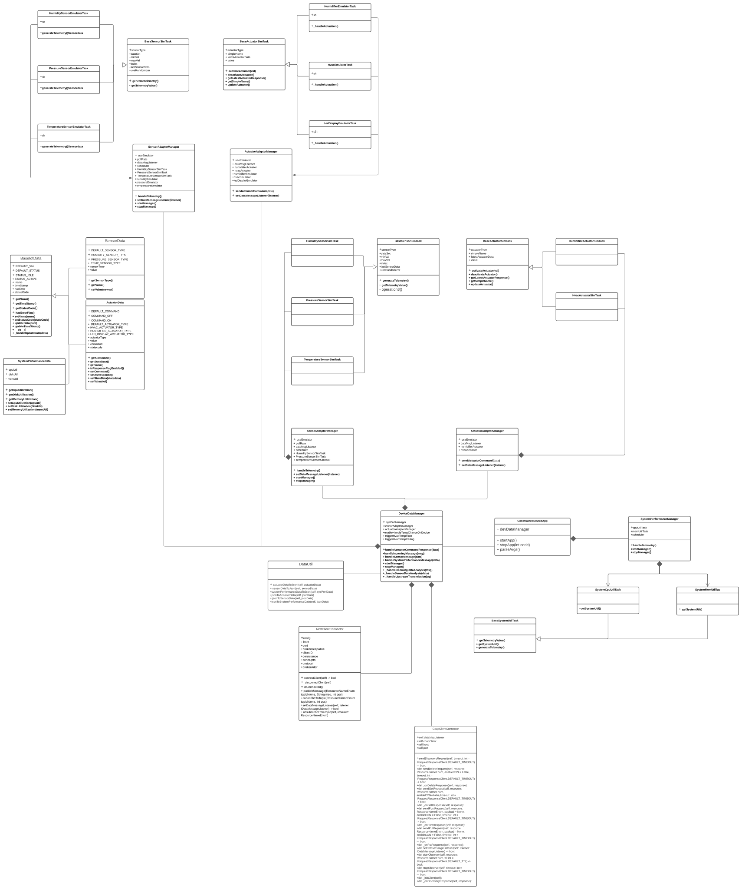

# Constrained Device Application (Connected Devices)

## Lab Module 10

Be sure to implement all the PIOT-CDA-* issues (requirements) listed at [PIOT-INF-10-001 - Chapter 10](https://github.com/orgs/programming-the-iot/projects/1#column-10488510).

### Description

NOTE: Include two full paragraphs describing your implementation approach by answering the questions listed below.

What does your implementation do? 

implement Mqttclient and Coapclient integration test.

How does your implementation work?

All test passed as supposed.

### Code Repository and Branch

NOTE: Be sure to include the branch (e.g. https://github.com/programming-the-iot/python-components/tree/alpha001).

URL:  https://github.com/NU-CSYE6530-Fall2020/constrained-device-app-xuanwu-neu/tree/chapter10

### UML Design Diagram(s)

NOTE: Include one or more UML designs representing your solution. It's expected each
diagram you provide will look similar to, but not the same as, its counterpart in the
book [Programming the IoT](https://learning.oreilly.com/library/view/programming-the-internet/9781492081401/).

### Unit Tests Executed

NOTE: TA's will execute your unit tests. You only need to list each test case below
(e.g. ConfigUtilTest, DataUtilTest, etc). Be sure to include all previous tests, too,
since you need to ensure you haven't introduced regressions.

- src/test/java/programmingtheiot/part02/unit/data
- 
- 

### Integration Tests Executed

NOTE: TA's will execute most of your integration tests using their own environment, with
some exceptions (such as your cloud connectivity tests). In such cases, they'll review
your code to ensure it's correct. As for the tests you execute, you only need to list each
test case below (e.g. SensorSimAdapterManagerTest, DeviceDataManagerTest, etc.)

- src/test/java/programmingtheiot/part03/integration/connection/MqttClientPerformanceTest.java
- src/test/java/programmingtheiot/part03/integration/connection/CoapClientPerformanceTest.java
- src/test/python/programmingtheiot/part03/integration/connection/MqttClientConnectorTest
- src/test/python/programmingtheiot/part03/integration/connection/DeviceDataManagerIntegrationTest
- rc/test/java/programmingtheiot/part02/integration/data

2020-12-04 20:33:42,629:MqttClientConnector:INFO:MQTT client is already disconnected.
2020-12-04 20:33:42,629:MqttClientPerformanceTest:INFO:Publish message - QoS 0 [10000]: 790.305 ms

2020-12-04 20:34:27,156:ConfigUtil:INFO:Loading config: ../../../../../../../config/PiotConfig.props
2020-12-04 20:34:27,158:ConfigUtil:DEBUG:Config: ['Mqtt.GatewayService', 'Coap.GatewayService', 'ConstrainedDevice']
2020-12-04 20:34:27,158:ConfigUtil:INFO:Created instance of ConfigUtil: <src.main.python.programmingtheiot.common.ConfigUtil.ConfigUtil object at 0x7ff0bdd75e20>
2020-12-04 20:34:27,159:MqttClientConnector:INFO:	MQTT Broker Host: localhost
2020-12-04 20:34:27,159:MqttClientConnector:INFO:	MQTT Broker Port: 1883
2020-12-04 20:34:27,159:MqttClientConnector:INFO:	MQTT Keep Alive:  60
2020-12-04 20:34:28,495:MqttClientConnector:INFO:MQTT client is already disconnected.
2020-12-04 20:34:28,497:MqttClientPerformanceTest:INFO:Publish message - QoS 1 [10000]: 1327.571 ms

2020-12-04 20:34:47,354:ConfigUtil:INFO:Loading config: ../../../../../../../config/PiotConfig.props
2020-12-04 20:34:47,357:ConfigUtil:DEBUG:Config: ['Mqtt.GatewayService', 'Coap.GatewayService', 'ConstrainedDevice']
2020-12-04 20:34:47,358:ConfigUtil:INFO:Created instance of ConfigUtil: <src.main.python.programmingtheiot.common.ConfigUtil.ConfigUtil object at 0x7f990ed3ee20>
2020-12-04 20:34:47,360:MqttClientConnector:INFO:	MQTT Broker Host: localhost
2020-12-04 20:34:47,361:MqttClientConnector:INFO:	MQTT Broker Port: 1883
2020-12-04 20:34:47,362:MqttClientConnector:INFO:	MQTT Keep Alive:  60

Ran 1 test in 2.141s

OK
2020-12-04 20:34:49,492:MqttClientConnector:INFO:MQTT client is already disconnected.
2020-12-04 20:34:49,492:MqttClientPerformanceTest:INFO:Publish message - QoS 2 [10000]: 2113.08 ms

Qos 0 fast and Qos 2 slow.

Testing POST - CON
POST message - useCON = True [1000]: 518.844 ms

Testing POST - NON

Ran 1 test in 0.385s

OK
POST message - useCON = False [1000]: 364.828 ms

CON slow NON slow.

