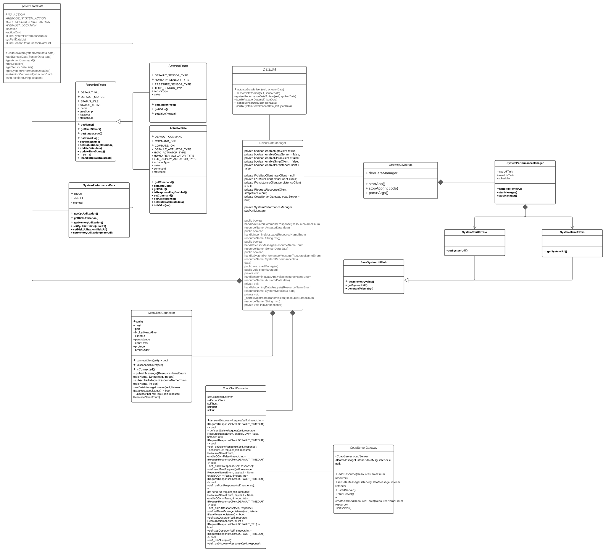

# Gateway Device Application (Connected Devices)

## Lab Module 08

Be sure to implement all the PIOT-GDA-* issues (requirements) listed at [PIOT-INF-08-001 - Chapter 08](https://github.com/orgs/programming-the-iot/projects/1#column-10488501).

### Description

NOTE: Include two full paragraphs describing your implementation approach by answering the questions listed below.

What does your implementation do? 

Implemented CoapServerGateway.

How does your implementation work?

All test passed as same as example.

### Code Repository and Branch

NOTE: Be sure to include the branch (e.g. https://github.com/programming-the-iot/python-components/tree/alpha001).

URL: https://github.com/NU-CSYE6530-Fall2020/gateway-device-app-xuanwu-neu/tree/chapter08

### UML Design Diagram(s)

NOTE: Include one or more UML designs representing your solution. It's expected each
diagram you provide will look similar to, but not the same as, its counterpart in the
book [Programming the IoT](https://learning.oreilly.com/library/view/programming-the-internet/9781492081401/).

### Unit Tests Executed

NOTE: TA's will execute your unit tests. You only need to list each test case below
(e.g. ConfigUtilTest, DataUtilTest, etc). Be sure to include all previous tests, too,
since you need to ensure you haven't introduced regressions.

- 
- 
- 

### Integration Tests Executed

NOTE: TA's will execute most of your integration tests using their own environment, with
some exceptions (such as your cloud connectivity tests). In such cases, they'll review
your code to ensure it's correct. As for the tests you execute, you only need to list each
test case below (e.g. SensorSimAdapterManagerTest, DeviceDataManagerTest, etc.)

- /src/test/java/programmingtheiot/part03/connection/CoapServerGatewayTest
- 
- 

EOF.

INFO: Starting server
Nov 19, 2020 3:29:34 PM org.eclipse.californium.core.CoapServer start
INFO: No endpoints have been defined for server, setting up server endpoint on default port 5683
Nov 19, 2020 3:29:34 PM org.eclipse.californium.core.network.CoapEndpoint start
INFO: Starting endpoint at 0.0.0.0/0.0.0.0:5683
Nov 19, 2020 3:29:34 PM org.eclipse.californium.core.network.CoapEndpoint start
INFO: Starting endpoint at 0.0.0.0/0.0.0.0:0
Nov 19, 2020 3:29:34 PM org.eclipse.californium.core.network.EndpointManager createDefaultEndpoint
INFO: Created implicit default endpoint 0.0.0.0/0.0.0.0:57386
Nov 19, 2020 3:29:34 PM programmingtheiot.part03.integration.connection.CoapServerGatewayTest testRunSimpleCoapServerGatewayIntegration
INFO:  --> WebLink: /.well-known/core. Attributes: org.eclipse.californium.core.server.resources.ResourceAttributes@2c767a52
Nov 19, 2020 3:29:34 PM programmingtheiot.part03.integration.connection.CoapServerGatewayTest testRunSimpleCoapServerGatewayIntegration
INFO:  --> WebLink: /PIOT. Attributes: org.eclipse.californium.core.server.resources.ResourceAttributes@619713e5
Nov 19, 2020 3:29:34 PM programmingtheiot.part03.integration.connection.CoapServerGatewayTest testRunSimpleCoapServerGatewayIntegration
INFO:  --> WebLink: /PIOT/ConstrainedDevice. Attributes: org.eclipse.californium.core.server.resources.ResourceAttributes@708f5957
Nov 19, 2020 3:29:34 PM programmingtheiot.part03.integration.connection.CoapServerGatewayTest testRunSimpleCoapServerGatewayIntegration
INFO:  --> WebLink: /PIOT/ConstrainedDevice/ActuatorCmd. Attributes: org.eclipse.californium.core.server.resources.ResourceAttributes@68999068
Nov 19, 2020 3:29:34 PM programmingtheiot.part03.integration.connection.CoapServerGatewayTest testRunSimpleCoapServerGatewayIntegration
INFO:  --> WebLink: /PIOT/ConstrainedDevice/MgmtStatusCmd. Attributes: org.eclipse.californium.core.server.resources.ResourceAttributes@7722c3c3
Nov 19, 2020 3:29:34 PM programmingtheiot.part03.integration.connection.CoapServerGatewayTest testRunSimpleCoapServerGatewayIntegration
INFO:  --> WebLink: /PIOT/ConstrainedDevice/MgmtStatusMsg. Attributes: org.eclipse.californium.core.server.resources.ResourceAttributes@2ef3eef9
Nov 19, 2020 3:29:34 PM programmingtheiot.part03.integration.connection.CoapServerGatewayTest testRunSimpleCoapServerGatewayIntegration
INFO:  --> WebLink: /PIOT/ConstrainedDevice/SensorMsg. Attributes: org.eclipse.californium.core.server.resources.ResourceAttributes@243c4f91
Nov 19, 2020 3:29:34 PM programmingtheiot.part03.integration.connection.CoapServerGatewayTest testRunSimpleCoapServerGatewayIntegration
INFO:  --> WebLink: /PIOT/GatewayDevice. Attributes: org.eclipse.californium.core.server.resources.ResourceAttributes@291ae
Nov 19, 2020 3:29:34 PM programmingtheiot.part03.integration.connection.CoapServerGatewayTest testRunSimpleCoapServerGatewayIntegration
INFO:  --> WebLink: /PIOT/GatewayDevice/MgmtStatusCmd. Attributes: org.eclipse.californium.core.server.resources.ResourceAttributes@61df66b6
Nov 19, 2020 3:29:34 PM programmingtheiot.part03.integration.connection.CoapServerGatewayTest testRunSimpleCoapServerGatewayIntegration
INFO:  --> WebLink: /PIOT/GatewayDevice/MgmtStatusMsg. Attributes: org.eclipse.californium.core.server.resources.ResourceAttributes@50eac852
Nov 19, 2020 3:29:34 PM programmingtheiot.part03.integration.connection.CoapServerGatewayTest testRunSimpleCoapServerGatewayIntegration
INFO:  --> WebLink: /PIOT/GatewayDevice/SystemPerfMsg. Attributes: org.eclipse.californium.core.server.resources.ResourceAttributes@16ec5519

