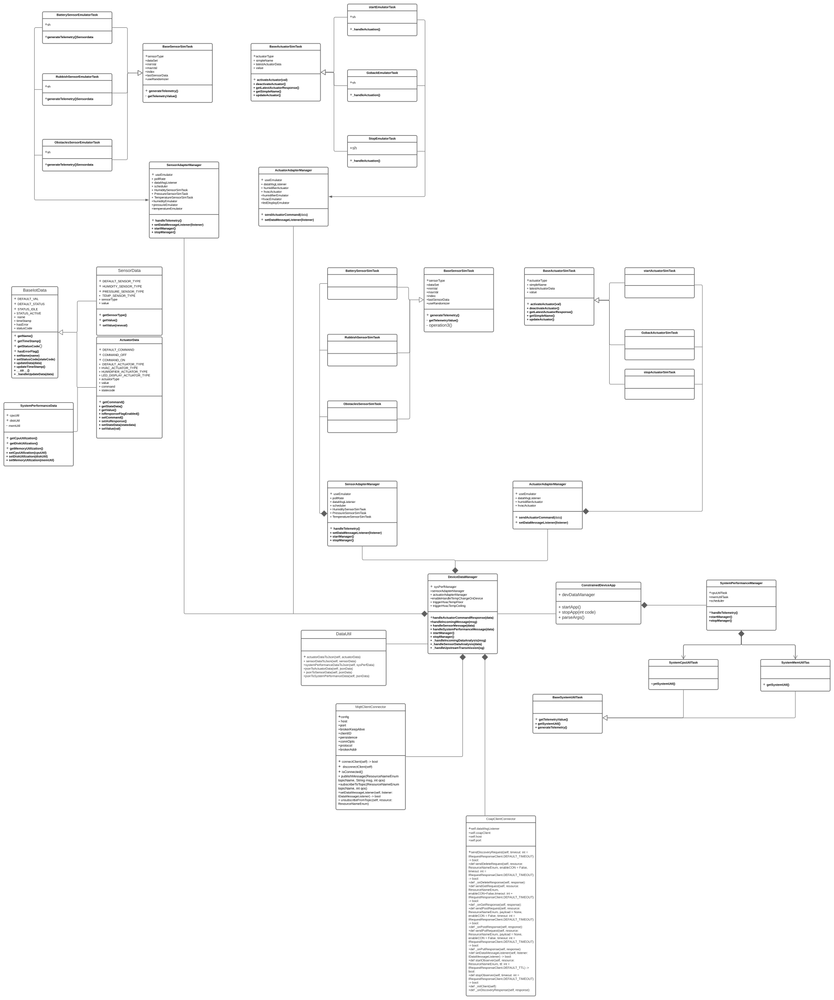
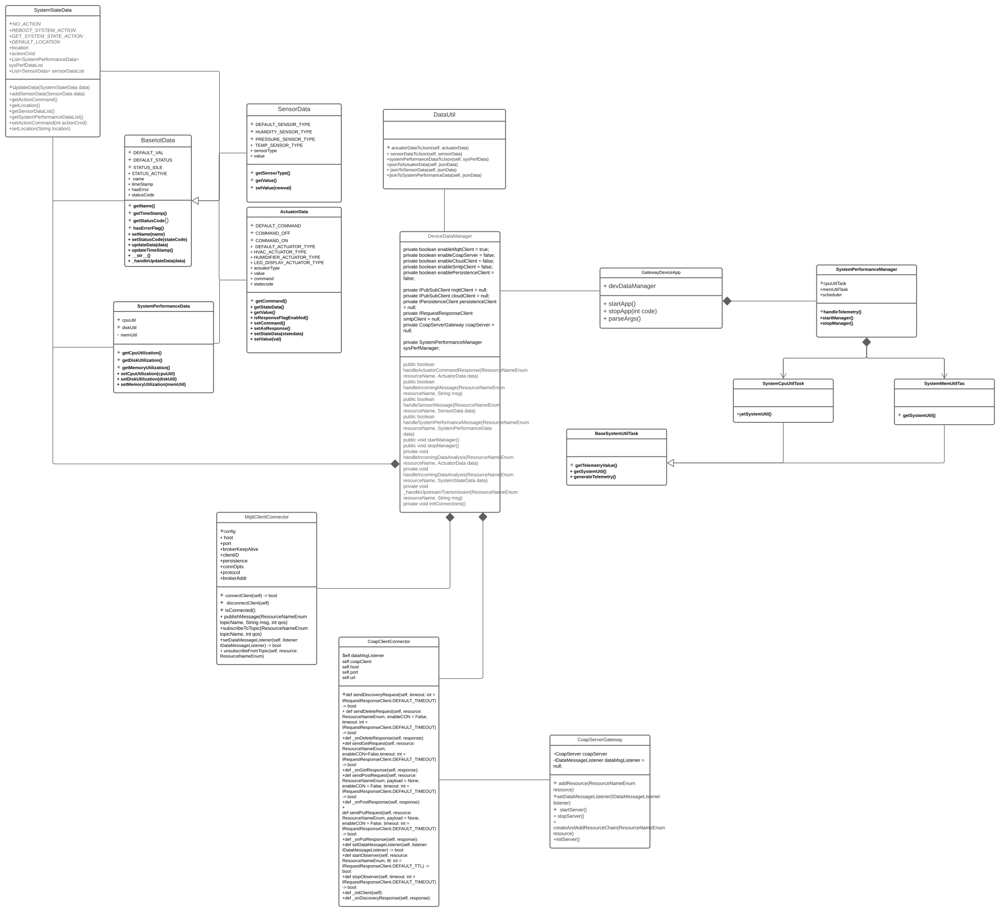
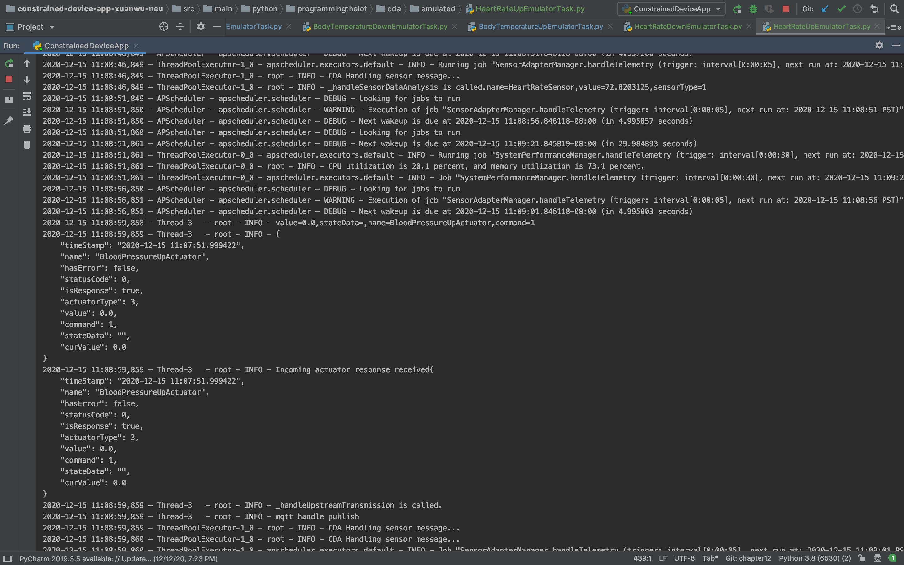
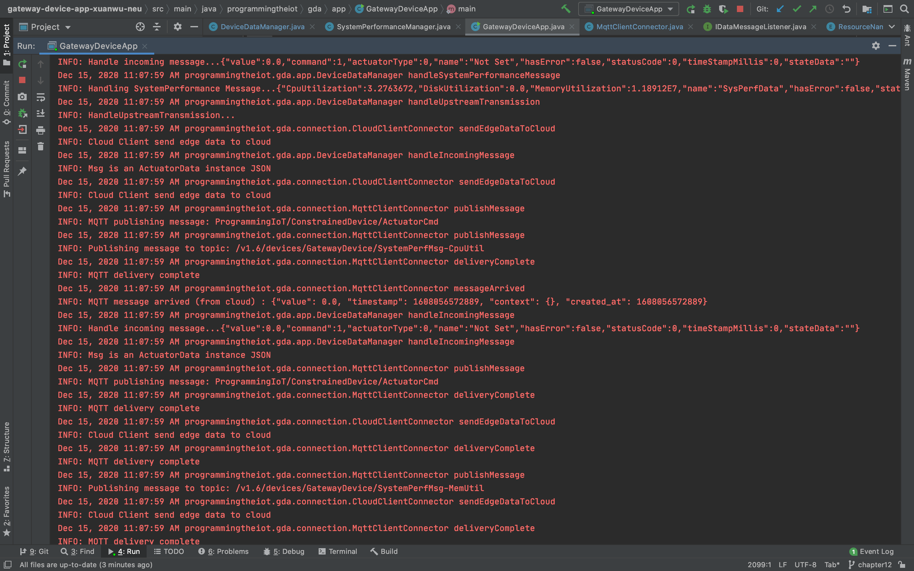
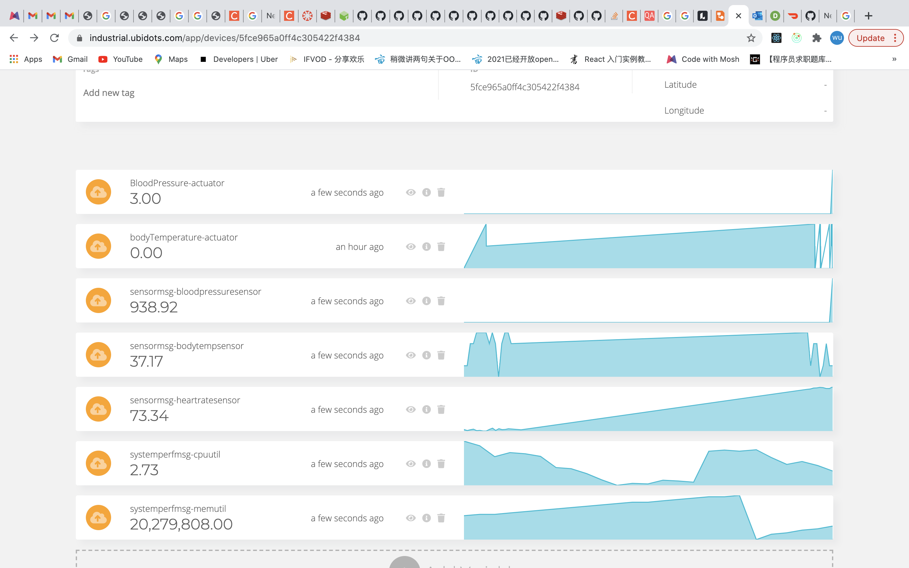
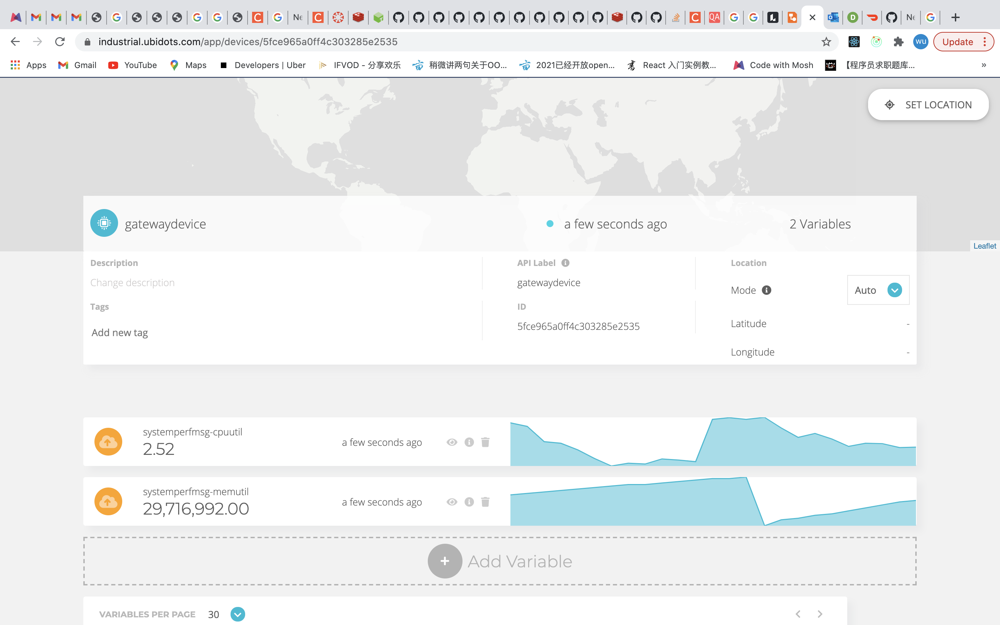
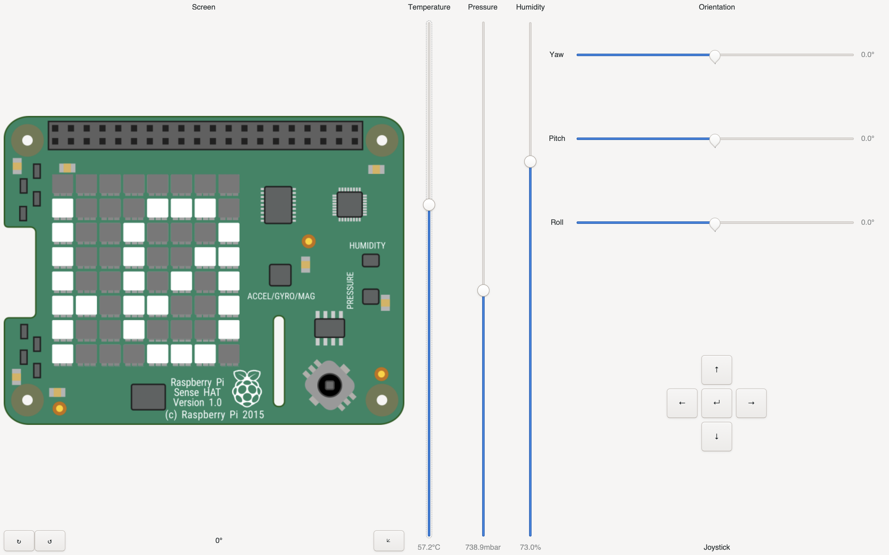

# Connected Devices - Semester Project Summary

## Lab Module 12 - Semester Project

Be sure to implement all the PIOT-INF-12-* requirements listed at [PIOT-INF-12-001 - Chapter 12](https://github.com/orgs/programming-the-iot/projects/1#column-10488565).

### Description

On the following page(s), be sure to address the following four topics: 
- What - The Problem
- Why - Who Cares?
- How - Actual Technical Approach
- Results - Actual Outcomes

### What - The Problem 

NOTE: Write one or two paragraphs to answer EACH of the following questions.

What problem are you trying to solve and why does it matter?

I use IoT System to solve the patient body data monitoring problem. Some patient's body data need to be monitored. If 
some accidents happened. The doctors and their family member can be notified Immediately.I designed a Iot system to 
monitor the body temperature, blood pressure and heart rate of patient. If any indicator is too high or too low. The 
System will notify people corresponding warning message. So that people can deal with different accidents quickly.

### Why - Who Cares? 

Why do you care about this particular problem? 

Some patients are in dangerous condition,even though they are same as normal people at most time. For Example, Heart patients
don't know when accidents will happen.So they need a System to gather their body data, and to notify them or their doctors and 
family members when accident happen. So that they can save the patients' life effectively.
 

### How - Actual Technical Approach

NOTE: Provide a high level system diagram depicting your planned technical approach. This should be a relatively
simple block diagram - you do NOT need to create a UML diagram for the proposal, although you should provide
specifics on which protocols you plan to use, where they’ll be used, and how you plan to communicate between
your constrained device, gateway device, and cloud services. You may make changes to this for the final
implementation if needed - this should serve merely as a guide. 

 
 

#### System Diagram

#### What THREE (3) sensors and ONE (1) actuator did you leverage (add more if you wish)?
- CDA Sensor 1: Blood pressure
- CDA Sensor 2: Body temperature
- CDA Sensor 3: Heart Rate
- CDA Actuator 1: Heart Rate Up Actuator

#### What ONE (1) CDA protocol and THREE (3) GDA protocols did you implement (add more if you wish)?
- CDA Protocol 1: mqtt qos 0 or 1

- GDA Protocol 1: mqtt qos 0 or 1
- GDA Protocol 2: 
- GDA Protocol 3: 
 
#### What TWO (2) cloud services / capabilities did you use (add more if you wish)?
- Cloud Service 1 (ingress): Ubidot
- Cloud Service 2 (egress):
 
### Results - Actual Outcomes and Visualization Screen Shot(s)

#### Outcomes Achieved

NOTE: Write a paragraph or two describing your actual achieved outcomes. 

The CDA can gather three different sensor data: blood pressure, body temperature, heart rate from patients. And CDA will
deal with the heart rate UP condition by create corresponding actuator data to alarm heart rate is too high. Three sensordata
will be transferd to GDA by mqtt protocol.
And GDA can deal with the heart rate down condition by create corresponding actuator to alarm heart rate is too low.
And GDA will transfer the sensor data which are collected from CDA to Cloud service. And received actuator data form Cloud service,
And also will transfer the actuator data to CDA by mqttClient.
The Cloud can control body temperature and blood pressure data. Add corresponding trigger event to create actuator data to transfer
GDA.

#### Screen Shots Representing Visualized Data

NOTE: Include (at least) TWO (2) screen shots - one showing at least 2 hours
of time-series data from the CDA, and one showing an event being triggered
that results in an actuation event sent to your GDA and then to your CDA.

EOF.
