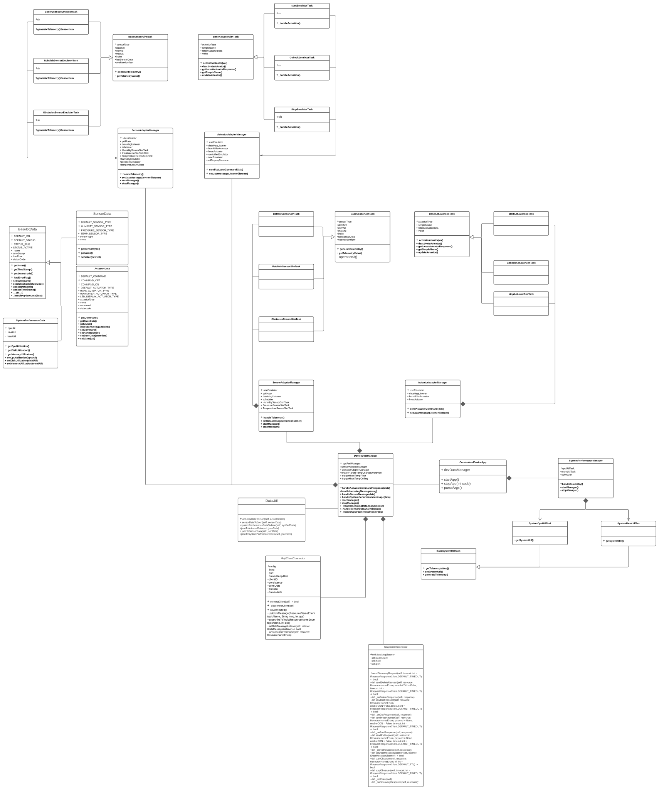
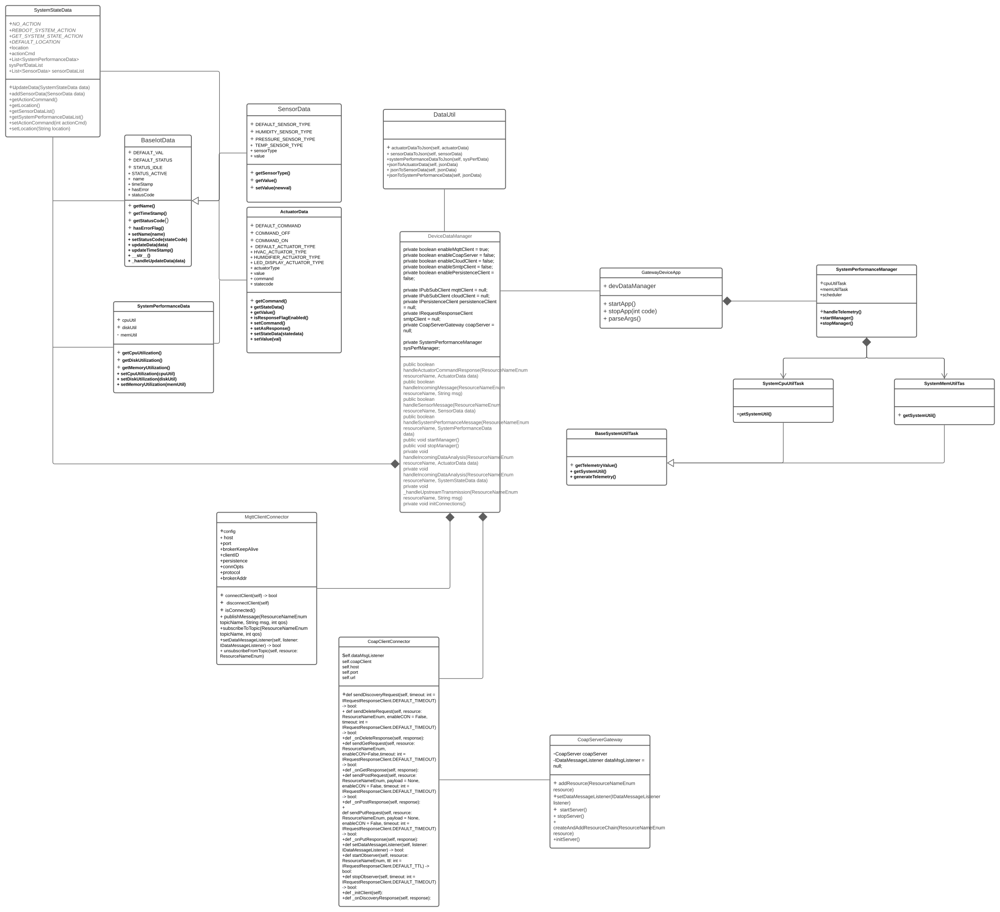

# Gateway Device Application (Connected Devices)

## Lab Module 12 - Semester Project Proposal

### Description

On the following page(s), be sure to address the following four topics: 
- What - The Problem
- Why - Who Cares?
- How - Expected Technical Approach
- Results - Expected Outcomes

### What - The Problem 

NOTE: Write one or two paragraphs to answer EACH of the following questions.

What problem are you trying to solve and why does it matter?

I use IoT System to solve the human body data monitoring problem. Some patient's body data need to be monitored. If 
some accidents happened. The doctors and their family member can be notified Immediately.I designed a Iot system to 
monitor the body temperature, blood pressure and heart rate of patient. If any indicator is too high or too low. The 
System will notify people corresponding warning message. So that people can deal with different accidents quickly.

### Why - Who Cares? 

Why do you care about this particular problem? 
 
Some patients are in dangerous condition,ven though they are same as normal people at most time. For Example, Heart patients
don't know when accidents will happen.So they need a System to gather their body data, and to notify them or their doctors and 
family members when accident happen. So that they can save the patients' life effectively.

### How - Expected Technical Approach

NOTE: Provide a high level design diagram depicting your planned technical approach. This should be a relatively
simple block diagram - you do NOT need to create a UML diagram for the proposal, although you should provide
specifics on which protocols you plan to use, where they’ll be used, and how you plan to communicate between
your constrained device, gateway device, and cloud services. You may make changes to this for the final
implementation if needed - this should serve merely as a guide. 

 
 
### Results - Expected Outcomes 

NOTE: Write one or two paragraphs to answer the following question.

If your project is successful, what outcome do you expect (e.g. what will happen if everything works)? 

It should implement several functions: 
1. the CDA can gather three different sensor data: blood pressure, body temperature, heart rate from patients. And CDA will
deal with the heart rate UP condition by create corresponding actuator data to alarm heart rate is too high. Three sensordata
will be transferd to GDA by mqtt protocol.
2. And GDA will deal with the heart rate down condition by create corresponding actuator to alarm heart rate is too low.
And GDA will transfer the sensor data which are collected from CDA to Cloud service. And received actuator data form Cloud service,
And also will transfer the actuator data to CDA by mqttClient.
3.the Cloud will control body temperature and blood pressure data. Add corresponding trigger event to create actuator data to transfer
 GDA.
4.If the Body temp or blood press or hear rate is too low or too high. People will receive corresponding message. 

EOF.
